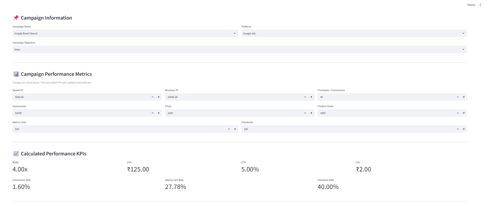
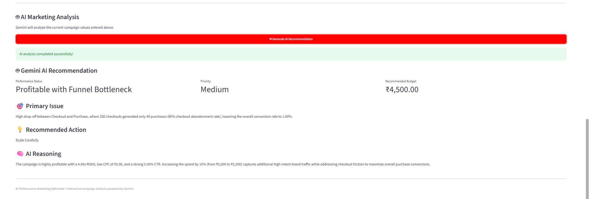

\# AI-Powered Performance Marketing Optimizer


\## 🚀 Live Demo


👉 \[Try the AI Performance Marketing Optimizer](https://ai-performance-marketing-optimizer.streamlit.app/)

## 📸 Application Screenshots

### Interactive Campaign Simulator



### AI Recommendation




An interactive AI-powered performance marketing simulator and campaign optimization tool built with Python, Streamlit, and Google Gemini.


The application allows users to enter or modify campaign performance metrics and instantly calculate key marketing KPIs. Gemini AI then analyzes the current campaign performance and generates actionable optimization recommendations.


\## 🚀 Project Overview


Performance marketers need to continuously evaluate campaign efficiency and decide whether campaigns should be scaled, maintained, tested, or reduced.


This project combines:


\- Interactive campaign inputs

\- Python-based KPI calculations

\- Generative AI analysis using Google Gemini

\- Performance marketing decision support

\- Power BI campaign analytics


The project demonstrates how AI can support performance marketing decisions using campaign-level metrics.


\## 🎯 Objectives


The project aims to:


\- Calculate important performance marketing KPIs

\- Analyze campaign efficiency

\- Identify campaign performance issues

\- Generate AI-powered optimization recommendations

\- Suggest appropriate campaign budget levels

\- Provide an interactive what-if style environment for campaign analysis

\- Visualize historical campaign performance using Power BI


\## 🧠 How It Works


```text

User enters campaign metrics

&#x20;         ↓

Python calculates marketing KPIs

&#x20;         ↓

Current metrics are sent to Gemini AI

&#x20;         ↓

Gemini analyzes campaign performance

&#x20;         ↓

AI generates optimization recommendation

&#x20;         ↓

Performance decision + budget recommendation

````


\## 📊 Interactive Campaign Simulator


The Streamlit application allows users to select a campaign and platform and modify campaign metrics such as:


\* Spend

\* Revenue

\* Purchases

\* Impressions

\* Clicks

\* Product Views

\* Add to Carts

\* Checkouts


The application automatically recalculates:


\* ROAS

\* CPA

\* CTR

\* CPC

\* Conversion Rate

\* Add-to-Cart Rate

\* Checkout Rate


Changing the input values changes the calculated KPIs and the AI recommendation.


\## 🤖 AI Optimization


Google Gemini evaluates the current campaign performance and generates:


\* Performance Status

\* Primary Issue

\* Recommended Action

\* Priority

\* Recommended Budget

\* Reasoning


Possible performance recommendations include:


\* Scale

\* Scale Carefully

\* Maintain / Test

\* Reduce


The AI recommendation is generated using the latest values entered into the application.


\## 📈 Performance Marketing Metrics


\### ROAS


Return on Ad Spend measures the revenue generated for every unit of advertising spend.


```text

ROAS = Revenue / Spend

```


\### CPA


Cost Per Acquisition measures the advertising cost associated with each purchase/conversion.


```text

CPA = Spend / Purchases

```


\### CTR


Click-Through Rate measures the percentage of impressions that resulted in clicks.


```text

CTR = Clicks / Impressions × 100

```


\### CPC


Cost Per Click measures the average advertising cost for each click.


```text

CPC = Spend / Clicks

```


\### Conversion Rate


Measures the percentage of clicks that resulted in purchases.


```text

Conversion Rate = Purchases / Clicks × 100

```


\## 🛠️ Technology Stack


\* Python

\* Streamlit

\* Pandas

\* Google Gemini API

\* Python-dotenv

\* Power BI

\* DAX

\* Excel


\## 📊 Power BI Dashboard


The project also includes a Performance Marketing Command Center developed in Power BI.


The dashboard provides:


\### Campaign Performance


Overview of campaign efficiency and performance metrics.


\### Platform Analysis


Comparison of campaign performance across advertising platforms.


\### Funnel Analysis


Analysis of the campaign funnel from impressions and clicks through product views, add-to-carts, checkouts and purchases.


\### Budget Allocation


Analysis of campaign budget allocation and performance.


\### Optimization Insights


Displays AI-generated campaign recommendations and recommended budget actions.


\## 🔄 Python AI Pipeline


The project also includes a Python-based campaign analysis pipeline.


The pipeline:


1\. Loads campaign performance data

2\. Cleans and processes the data

3\. Aggregates campaign-level metrics

4\. Calculates ROAS and CPA

5\. Sends campaign metrics to Gemini

6\. Generates AI recommendations

7\. Validates AI budget recommendations

8\. Produces campaign recommendation outputs


\## 📁 Project Structure


```text

AI-Performance-Marketing-Optimizer/

│

├── app.py

├── ai\_marketing\_optimizer.py

├── requirements.txt

├── README.md

├── .gitignore

└── .env.example

```


\## 🔐 API Key Security


The Gemini API key is stored in an environment variable and is not included in the repository.


The `.env` file is excluded using `.gitignore`.


To run the application locally, create a `.env` file:


```text

GEMINI\_API\_KEY=your\_api\_key\_here

```


Never commit or publicly share your actual API key.


\## ▶️ Run the Application


Install the required packages:


```bash

pip install -r requirements.txt

```


Run the Streamlit application:


```bash

python -m streamlit run app.py

```


The application will open in your browser.


\## 📌 Example Use Case


A marketer can enter:


\* Advertising spend

\* Revenue

\* Purchases

\* Impressions

\* Clicks

\* Funnel metrics


The application calculates the campaign KPIs and sends the current performance data to Gemini.


Gemini then provides an optimization recommendation based on the campaign's current performance.


This allows marketers to quickly test different campaign scenarios without manually recalculating performance metrics.


\## 💼 Business Value


The project demonstrates how AI can assist performance marketers by helping them:


\* Identify high-performing campaigns

\* Detect inefficient campaigns

\* Prioritize optimization opportunities

\* Evaluate campaign efficiency

\* Support budget allocation decisions

\* Reduce manual KPI calculations

\* Generate faster campaign analysis


\## 📌 Project Scope


This is a portfolio and decision-support project using campaign performance data.


The AI recommendations are intended to support marketing analysis and should be reviewed by a marketer before making real-world advertising budget changes.


\## 🔮 Future Improvements


Possible future enhancements include:


\* What-if budget simulator

\* Historical AI recommendation tracking

\* Automated daily campaign data ingestion

\* Google Ads API integration

\* Meta Ads API integration

\* Campaign forecasting

\* Automated performance alerts

\* A/B testing recommendations

\* Historical performance comparison

\* AI-generated campaign reports


\## 👩‍💻 Skills Demonstrated


\* Performance Marketing

\* Marketing Analytics

\* KPI Analysis

\* ROAS \& CPA Analysis

\* Python

\* Pandas

\* Streamlit

\* Generative AI

\* Google Gemini API

\* Power BI

\* DAX

\* Data Visualization

\* AI-assisted Marketing Optimization


